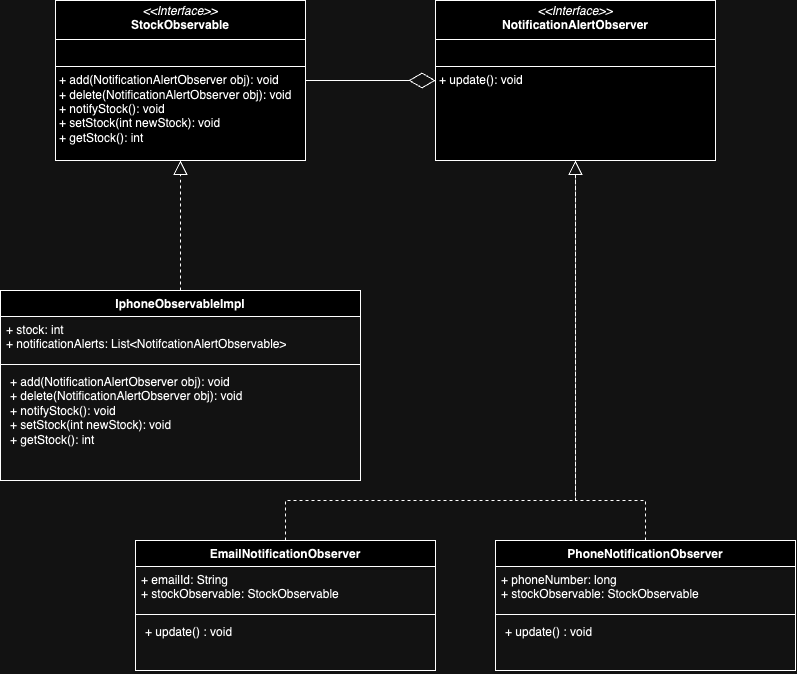

# Observer Design Pattern

The Observer design pattern is a behavioral design pattern in which an object, known as the Observable, 
maintains a list of its dependents, called observers, and notifies them of any state changes, 
usually by calling one of their methods. This pattern is widely used to implement distributed event-handling systems.

## Key Components

1. **Observable**:
    - Maintains a list of observers.
    - Provides methods for attaching and detaching observers.
    - Notifies observers of state changes.

2. **Observer**:
    - Defines an updating interface for objects that should be notified of changes in a subject.

3. **ConcreteObservable**:
    - Stores the state of interest to ConcreteObservers.
    - Notifies observers when its state changes.

4. **ConcreteObserver**:
    - Implements the Observer interface to keep its state consistent with the subject's state.

## Advantages
- Promotes loose coupling between the subject and observers.
- Enables dynamic relationships between objects at runtime.

## Disadvantages
- Can lead to memory leaks if observers are not properly removed.
- The order in which observers are notified is not guaranteed.

## Related Patterns
- **Mediator**: Encapsulates interaction logic between objects.
- **Publish-Subscribe**: Often considered a broader version of the Observer pattern.

---

[Back to Main Documentation](README.md)
